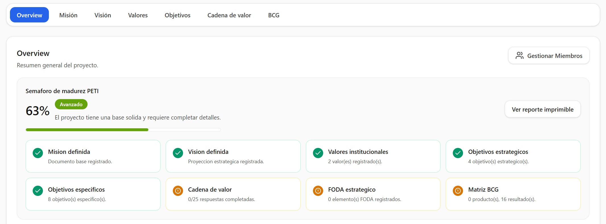
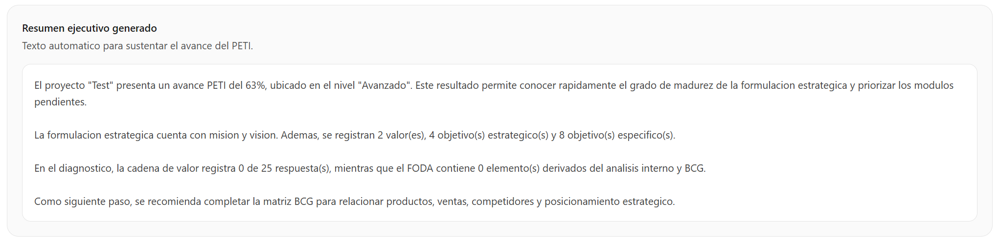
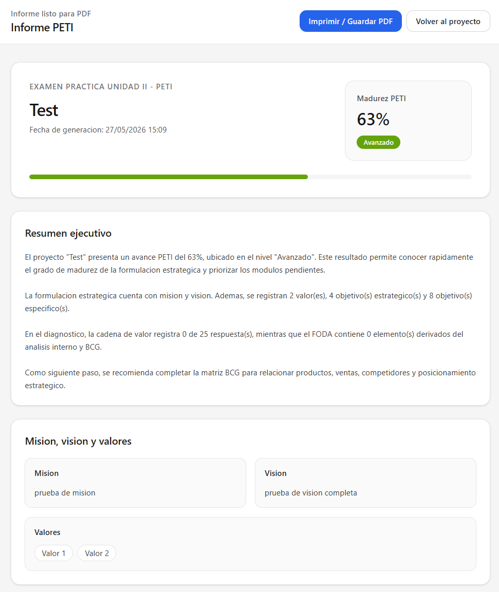
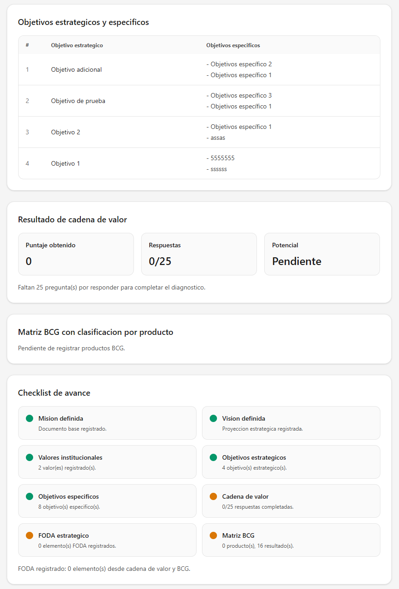
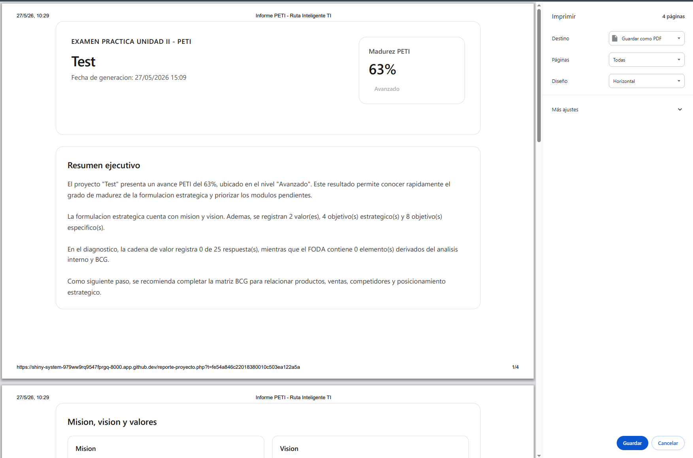

# Examen Práctica Unidad II - PETI

## Alumno
Junior Mamani Estaña

## Fecha
27 de mayo de 2026

## Repositorio GitHub
URL del repositorio público:

[PE_II_EXAMEN_PRACTICO](https://github.com/zJunior99/PE_II_EXAMEN_PRACTICO_PRUEBA.git)

## Descripción del Sistema

El sistema **Ruta Inteligente TI** es una aplicación web para la elaboración y gestión de un Plan Estratégico de Tecnologías de Información (PETI). Permite registrar proyectos, definir misión, visión, valores, objetivos estratégicos y objetivos específicos, además de realizar análisis mediante cadena de valor, FODA y matriz BCG.

El sistema fue desarrollado con PHP bajo el patrón MVC, utilizando Supabase/PostgreSQL como servicio de base de datos y Tailwind CSS para la interfaz.

## Mejoras Implementadas

### Mejora 1: Semáforo de Madurez PETI

Se implementó un semáforo de madurez que calcula automáticamente el avance del proyecto PETI según los módulos completados dentro del sistema.

El cálculo considera componentes como:

- Misión
- Visión
- Valores
- Objetivos estratégicos
- Objetivos específicos
- Cadena de valor
- FODA
- Matriz BCG

El resultado se muestra como un porcentaje de avance y un estado de madurez:

- Inicial
- En progreso
- Avanzado
- Completo

Esta mejora permite identificar rápidamente qué tan desarrollado se encuentra el plan estratégico y qué módulos aún están pendientes.

#### Captura de la mejora

---

### Mejora 2: Generador de Resumen Ejecutivo PETI

Se agregó un generador automático de resumen ejecutivo que utiliza la información registrada en el proyecto para producir una descripción formal del avance del PETI.

El resumen considera:

- Nombre del proyecto
- Porcentaje de avance
- Estado de madurez
- Misión y visión
- Valores registrados
- Objetivos estratégicos y específicos
- Estado de cadena de valor
- Estado de FODA
- Estado de matriz BCG

Esta mejora permite que el sistema no solo almacene información, sino que también genere una interpretación ejecutiva útil para presentar el avance del proyecto.

#### Captura de la mejora

---

### Mejora 3: Informe PETI Imprimible / Exportable a PDF

Se implementó una vista de informe PETI preparada para impresión o exportación a PDF desde el navegador.

El informe contiene:

- Portada con nombre del proyecto y fecha
- Nivel de madurez PETI
- Resumen ejecutivo
- Sección de misión, visión y valores
- Tabla de objetivos estratégicos y objetivos específicos
- Resultado de cadena de valor con puntaje
- Tabla BCG con clasificación por producto
- Checklist de avance del proyecto

Esta mejora permite generar una evidencia formal del trabajo realizado en el sistema y facilita la presentación del PETI como documento académico o ejecutivo.

#### Captura de la mejora

---

