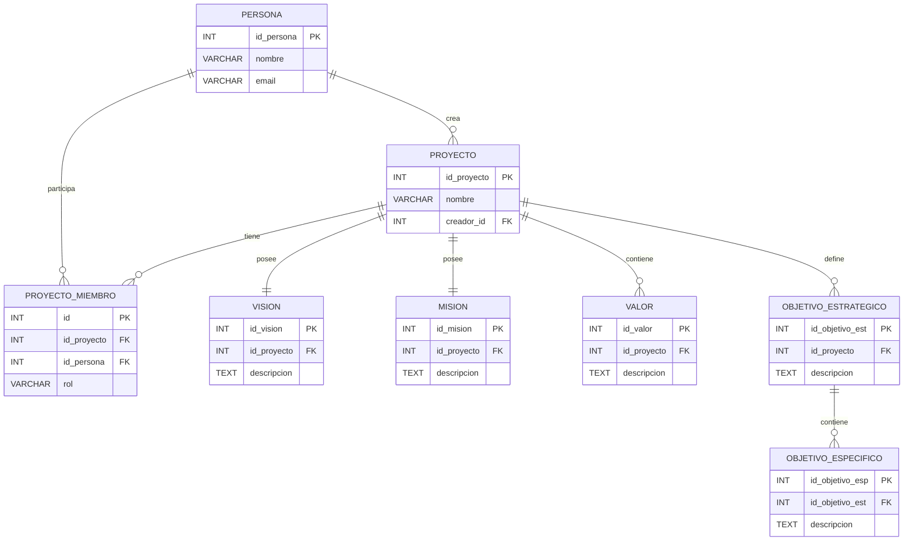

# Diagrama ER - Base de Datos

```mermaid
erDiagram

    PERSONA {
        INT id_persona PK
        VARCHAR nombre
        VARCHAR email
    }

    PROYECTO {
        INT id_proyecto PK
        VARCHAR nombre
        INT creador_id FK
    }

    PROYECTO_MIEMBRO {
        INT id PK
        INT id_proyecto FK
        INT id_persona FK
        VARCHAR rol
    }

    VISION {
        INT id_vision PK
        INT id_proyecto FK
        TEXT descripcion
    }

    MISION {
        INT id_mision PK
        INT id_proyecto FK
        TEXT descripcion
    }

    VALOR {
        INT id_valor PK
        INT id_proyecto FK
        TEXT descripcion
    }

    OBJETIVO_ESTRATEGICO {
        INT id_objetivo_est PK
        INT id_proyecto FK
        TEXT descripcion
    }

    OBJETIVO_ESPECIFICO {
        INT id_objetivo_esp PK
        INT id_objetivo_est FK
        TEXT descripcion
    }

    PERSONA ||--o{ PROYECTO : crea
    PERSONA ||--o{ PROYECTO_MIEMBRO : participa
    PROYECTO ||--o{ PROYECTO_MIEMBRO : tiene

    PROYECTO ||--|| VISION : posee
    PROYECTO ||--|| MISION : posee
    PROYECTO ||--o{ VALOR : contiene

    PROYECTO ||--o{ OBJETIVO_ESTRATEGICO : define

    OBJETIVO_ESTRATEGICO ||--o{ OBJETIVO_ESPECIFICO : contiene
```
